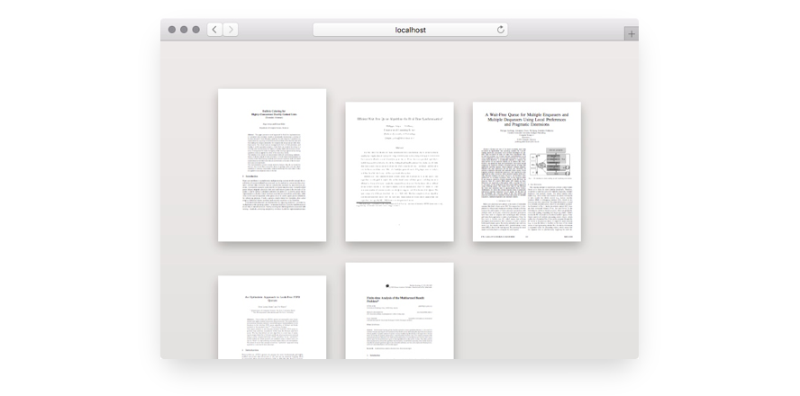

# pdf-preview-webapp

📄🔍 a small web application for previewing PDFs

[](docs/screenshot.jpg)

## Usage

The repository covers multiple integration scenarios. It can be used as a standalone server, but it also exports an express/connect compatible middleware.

The standalone server is a simple [express.js][express] app. You can start it by running the `server.js` script (for example via `yarn start`).
The server listens on port 8000 by default, but this can be changed by setting the `PORT` environment variable.
In this case you do not need the `devDependencies` which `yarn install` helpfully ignores when exporting `NODE_ENV=production`.

```console
$ export NODE_ENV=production PORT=8099
$ yarn install
$ yarn start
```

You can also `require( 'pdf-preview-webapp' )` to mount the application inside another express application. (Express [supports](http://expressjs.com/en/4x/api.html#app.use) nested apps.)

```js
const express = require( 'express' );
const previewApp = require( 'pdf-preview-webapp' );

const app = express();
app.use( '/preview', previewApp );
```

To start a `webpack-dev-server` instance running the application (including server side rendering) use `yarn dev`. This requires `devDependencies` to be installed:

```console
$ export NODE_ENV=
$ yarn install
$ yarn dev
```

## What's what

The `dist` directory contains the files that make up the actual application.

- `server.js` the express middleware that pre-renders the application on the server and handles the HTTP requests
- `browser.js` the actual web application that runs in your browser, including dependencies
- `style.css` CSS for the web application
- `*.worker.js` the source file for the web worker that renders PDF files
- `stats.json` a manifest of files created when building the web application; used by the server

## Options

_TBD_


[express]: http://expressjs.com
[webpack]: https://webpack.js.org

